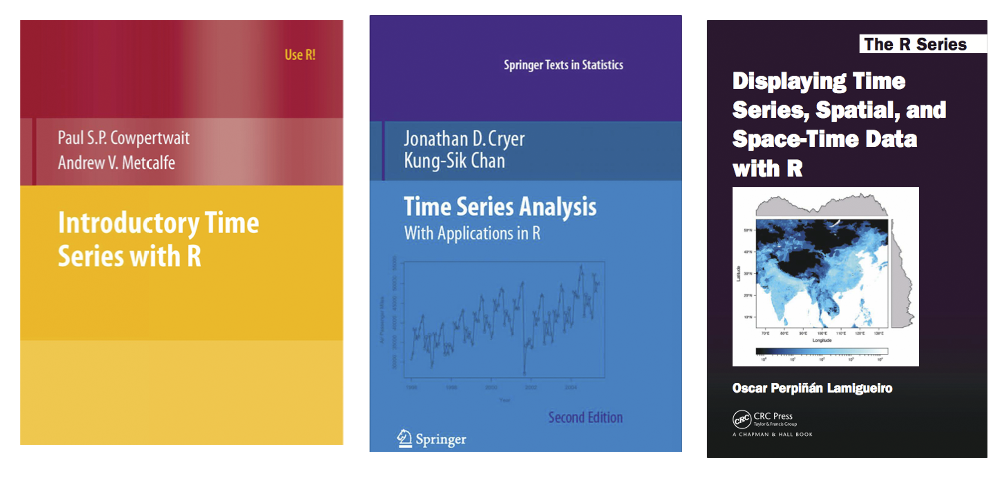
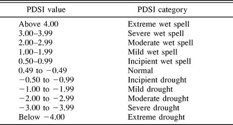
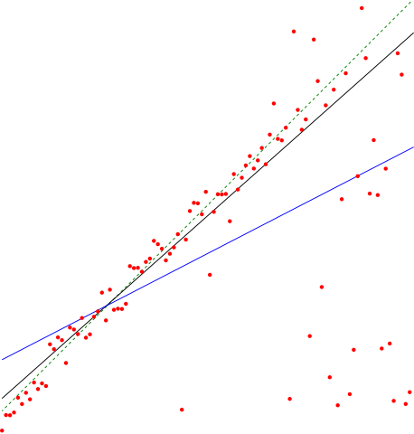
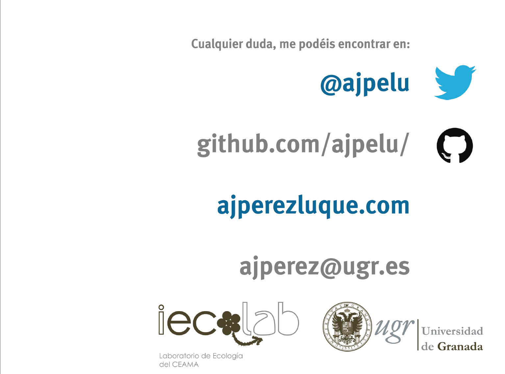

<!-- Center image on slide -->
<script src="http://ajax.aspnetcdn.com/ajax/jQuery/jquery-1.7.min.js"></script>
<script type='text/javascript'>
$(function() {
    $("p:has(img)").addClass('centered');
});
</script>


<style>
em {
  font-style: italic
}
strong {
  font-weight: bold;
}
</style>

<!-- Limit image width and height -->
<style type='text/css'>
img {
    max-height: 560px;
    max-width: 964px;
}
</style>

--- .quote
<br>
<br>
<br>
<q align=right>¿Qué es una <br>__Serie Temporal__? </q>

--- 
* Conjunto de observaciones registradas a intervalos regulares de tiempo. 
* En cada instante $\t_{i}$ la observación proviene de una variable que puede tener igual o diferente distribución
* El orden de llegada de los datos es importante

* Ejemplos: temperaturas, productividad del bosque a lo largo del año, cantidad de agua que lleva un río cada día, etc.  

* 

--- .quote
<br>
<br>
<br>
<q align=right>¿Por qué nos interesa analizar una <br>__Serie Temporal__? </q>

--- 
 * Para comprobar la ciclidad de un fenómeno
 * Analizar si los datos se ajustan bien a un modelo teórico
 * Analizar fenómenos espacio-temporales (avanzado)

<iframe width="250" height="150" frameborder="0"
  src="http://player.vimeo.com/video/104330415?title=0&amp;byline=0&amp;portrait=0" >
</iframe>

--- 
## Evolución de un proceso ecológico en diferentes ecosistemas

<iframe width="250" height="150" frameborder="0"
  src="http://player.vimeo.com/video/22945147?title=0&amp;byline=0&amp;portrait=0" >
</iframe>

--- .quote
## Objetivos:
__Explicar la evolución de un fenómeno a lo largo del tiempo__ 

```{r, echo=FALSE, fig.width=12, fig.height=6}
alisado <- HoltWinters(co2)
par(cex.axis=1.5, cex.lab=1.5, cex.main=1.5)
plot(alisado, ylab="Concentracion de CO2 (ppm)", xlab="", main="")
labs <- c("Valores observados", "Valores predichos")
legend("topleft", lty=c(1,1), col=c("black", "red"), legend=labs)
```

--- .quote
## Objetivos
__Predecir su valores en el futuro__

```{r, echo=FALSE, fig.width=12, fig.height=6}
par(cex.axis=1.5, cex.lab=1.5, cex.main=1.5)
pred.alisado <- predict(alisado, n.ahead=120, prediction.interval=TRUE)
plot(alisado, pred.alisado, ylab="Concentracion de CO2 (ppm)", xlab="", main="")
title("Predicciones de la concentracion de CO2")
labs <- c("Valores observados", "Valores predichos", "IC de las predicciones")
legend("topleft", lty=rep(1,3), col=c("black", "red", "blue"), legend=labs)
```


--- .quote
<br>
<br>
<br>
<q align=right>__Tipos__ de Series Temporales? </q>


--- .quote
## Estacionarias 
```{r, echo=FALSE, fig.width=12, fig.height=4.5}
p <- read.table('http://www.iecolab.es/ecoinfo/precip_qp_caniar.csv', header = TRUE, sep=',')
plot(p, type='o', cex=0.8, pch=19, col='#325B84',
     main= 'Precipitacion en el Robledal de Caniar',
     ylab='Precipitacion (mm)', xlab='Time')
abline(h=mean(p$prec), lty=2, lwd=2, col='gray30')
```


> * Los datos varían todo el tiempo alrededor del mismo __valor medio__ y con la __misma variabilidad__. 
* La relación entre las observaciones en dos momentos del tiempo diferentes
sólo depende del número de observaciones que distan entre ambas

[Observatorio de Cambio Global de Sierra Nevada](https://obsnev.es/linaria)

--- .quote
## No Estacionarias 
```{r, echo=FALSE, fig.width=12, fig.height=4.5}
tmin<- read.table('http://www.iecolab.es/ecoinfo/tmin_psn05.csv', header = TRUE, sep=',')
tmin$date <- as.Date(tmin$date) 
plot(tmin$tmin_real~tmin$date, cex=0.5, pch=19, col='#325B84',
     main= 'Temperatura minima Estacion PSN05 El Encinar (Sierra Nevada)',
     ylab='Temperatura minima (grados C)', xlab='Time')
```


> * La media, la varianza y/o la relación entre distantes equiespaciados __cambian__ a lo largo del tiempo. 
* Algunas oscilan con periodicidad regular (estacional)


--- .quote
## No Estacionarias 
```{r, echo=FALSE, fig.width=12, fig.height=5}
data(co2)
plot(co2, ylab = expression("Atmospheric concentration of CO"[2]),
     col='#325B84', lwd=2,
     las = 1)
```

> * Tendencia (serie no estacionaria estacional con tendencia)

--- 
## No Estacionarias  
```{r, echo=FALSE, fig.width=12, fig.height=5}
data(AirPassengers)
plot(AirPassengers, ylab="Numero de Pasajeros", xlab="time",
    col='#325B84', lwd=2)
```

> * Aumenta la variabilidad con el tiempo (serie no estacionaria con aumento de variabilidad)

---
## Tutoriales y Recursos:

[CRAN Task View: Time Series Analysis](http://cran.r-project.org/web/views/TimeSeries.html)

Falk M (2012). A First Course on Time Series Analysis - Examples with SAS. Chair of Statistics, University of Wurzburg. [link](http://www.statistik-mathematik.uni-wuerzburg.de/wissenschaftforschung/time_series/the_book/) 

<p align="center"></p>


--- &twocol
## Análisis de la tendencia 

*** =left
* ¿Incrementan o disminuyen los valores con el tiempo?
* En terminos estadísticos, determinar si la distribución de probabilidad de los datos cambian con el tiempo.
* Interés en determinar la cantidad o tasa de cambio 

# Hipótesis
* $H_0$: Los datos son independientes y aleatoriamente ordenados (No existe tendencia)
* $H_1$: Existe una tendencia

*** =right
<p align="center"></p>


--- .quote
<br>
<br>
<br>
<q align=right>Un pequeño __reto__</q>

--- .minicodefont
```{r}
m <- lm(p$prec~p$year)
msum <- summary(m)
msum$coefficients
```


```{r, echo=FALSE, fig.width=12, fig.height=5}
plot(p, type='o', cex=0.8, pch=19, col='#325B84',
     main= 'Precipitacion en el Robledal de Caniar',
     ylab='Precipitacion (mm)', xlab='Time')
abline(lm(p$prec~p$year), col='black', lwd=1.3)
```

--- .quote
## Test de Mann-Kendall
* Es un caso especial del test de correlación de Kendall ($\tau$)
* Comprobar si los valores de la variable ___Y___  tienden a aumentar o a disminuir con el tiempo
* Basado en el ranking relativo de los datos (no sobre los datos en sí)
* Test no paramétrico (no asumimos distribuciones de los datos)

(Mann, 1945; Kendall, 1975)

* Se calcula un valor de un __estadístico ($\tau$)__:
 * $\tau =$ -1; tendencia decreciente
 * $\tau =$ 0; no tendencia
 * $\tau =$ 1; tendencia ascendente

--- .quote
* Muy utilizado para el análisis de tendencias en series temporales en climatología, hidrología, etc. 

* __ventajas__: 
 * Es un test no paramétrico (no requiere que asumamos distribuciones en los datos)
 * Tiene una baja sensibilidad para cambios abruptos (datos faltantes) 

* __inconvenientes__:
 * no predicción
 * no informa sobre la tasa de cambio (pendiente)

* [Aplicaciones](http://obsnev.es/ontologia) 
<p align="center"></p>


---
<p align="center"></p>


--- .quote
<br>
<br>
<br>
<q align=right>Caso de __estudio__</q>

--- &twocol
# Evolución de la sequía en el estado de California durante los últimos 120 años 

*** =left
* La sequía es una preocupación global (cambio climático + aumento demanda)
* Los modelos indican que las regiones secas del mundo serán mas secas en el futuro
* En US, provoca daños anuales de entre $6-8 mill.
* California es una de las regiones mas afectadas por la sequía
* Pérdidas de -1.5 cm/año en las reservas de agua entre 2003 y 2012 
* Aumento severidad en los últimos años, especialmente el año 2014 en California

*** =right
<p align="center"></p>

---


Satellite image from NASA's Gravity Recovery and Climate Experiment (GRACE) mission showing California's devastating loss of fresh water (in red) since 2002. [NASA/JPL-Caltech/UCA](http://photojournal.jpl.nasa.gov/catalog/pia18816)

---
# ¿Qué vamos a hacer? 
Analizar la tendencia temporal del índice de sequía anual scPDSI (self-calibrate Palmer Drought Severity Index) durante los últimos 120 años (datos del [WestWideDroughtTracker](http://www.wrcc.dri.edu/wwdt/time/))
<br>
<br>
<p align="center"></p>


--- .minicodefont 
```{r}
anual <- read.table('http://www.iecolab.es/ecoinfo/scpdsi_annual.csv', header = TRUE, sep=',')
str(anual)
head(anual)
```

--- .minicodefont  
```{r, echo=TRUE, fig.width=12, fig.height=6}
plot(anual$year, anual$scpdsi, type='o', 
     xlab='year', pch=19, col='#325B84',
     ylab='scpdsi', ylim=c(-6,6))
abline(h=0)
abline(h=-2, lty=2, col='red')
```

--- .minicodefont 
# Analizar la tendencia 
```{r}
library('Kendall')
# Aplicar la función MannKendall (consultar ayuda)
m <- MannKendall(anual$scpdsi)
m
```

<br>
<br>
# ¿Se podría estimar la tendencia mediante un modelo lineal?

```{r, echo=TRUE, eval=FALSE}
ml <- lm(anual$year~anual$scpdsi)
summary(ml)
```

--- .minicodefont 
```{r, echo=FALSE, fig.width=12, fig.height=10}
ml <- lm(anual$year~anual$scpdsi)
par(mfrow=c(2,2))
plot(ml)
```

---  .minicodefont 
```{r}
summary(ml)
```

--- .quote
<br>
<br>
<br>
<q align=right>¿En que meses es __mayor__ la tendencia</q>

--- .minicodefont 

```{r, echo=FALSE, fig.width=12, fig.height=12, warning=FALSE}
mensual <- read.table('http://www.iecolab.es/ecoinfo/scpdsi_monthly.csv', header = TRUE, sep=',')
library('reshape2')
library('zoo')
mensuales <- dcast(mensual, year ~ month, value.var = 'value')   
names(mensuales) <- c('year','jun','jul','aug','sep')
mizoo <- zoo(mensuales[-1], mensuales[,1])
plot(mizoo, type='o', pch=19, main='scPDSI index', col='#325B84', cex.lab=2.5, cex.axis=1.5)
```

--- .quote
## Estimación de la magnitud de la tendencia
* ___estimador Theil-Sen___ o ___estimador de la pendiende de Sen___ 
* Se trata de un estimador robusto de una tendencia (no es un test)
* Se calcula la mediana de las pendientes entre todos los pares de puntos 
* Permite comparar la tasa de cambio de las tendencias entre series temporales 

<p align="center"></p>

--- .minicodefont 
# Cargar Datos
```{r, echo=TRUE}
mensual <- read.table('http://www.iecolab.es/ecoinfo/scpdsi_monthly.csv', header = TRUE, sep=',')
library('reshape2') # Para manipular datos
library('zoo') # Para series temporales
str(mensual)
head(mensual)
```

--- .minicodefont 
# Preparar Datos
```{r, echo=TRUE}
mensuales <- dcast(mensual, year ~ month, value.var = 'value')   
names(mensuales) <- c('year','jun','jul','aug','sep')
head(mensuales)
```


--- .minicodefont 
# Convertir datos
```{r, echo=TRUE}
mizoo <- zoo(mensuales[-1], mensuales[,1])
str(mizoo)
```

--- .minicodefont
# Calcular la tendencia y estimar la pendiente 
```{r, echo=TRUE, warning=FALSE}
library('wq')
theil <- mannKen(as.ts(mizoo))
theil
```


--- .quote
<br>
<br>
<br>
<q align=right>__Reto extra__: <br>¿Cómo ha evolucionado la sequía anual en los últimos 15 años? <br>¿Qué meses han mostrado una mayor tasa de cambio? </q>

--- 



