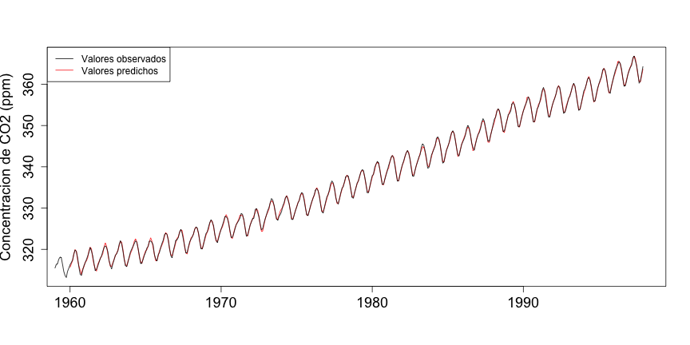
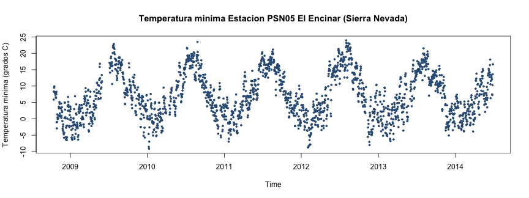
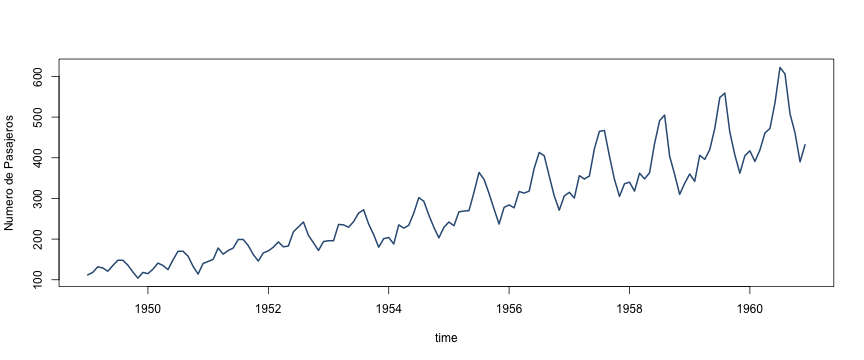
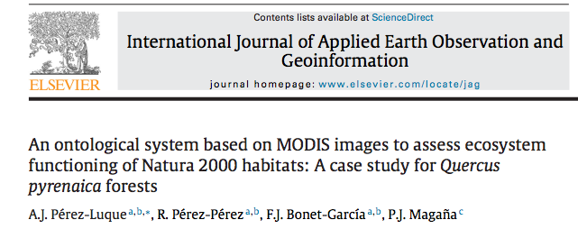
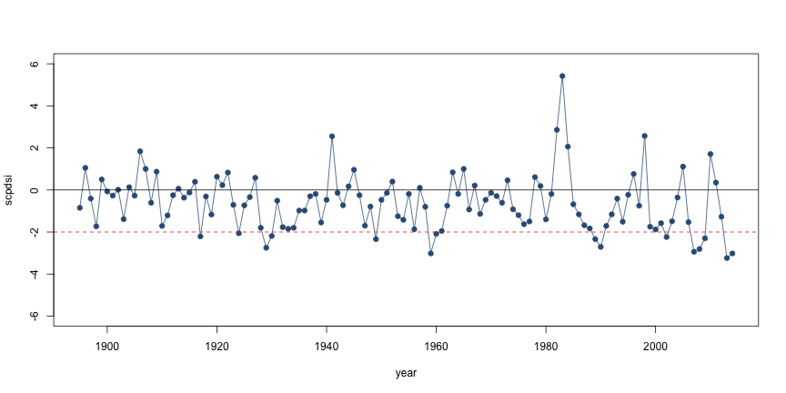
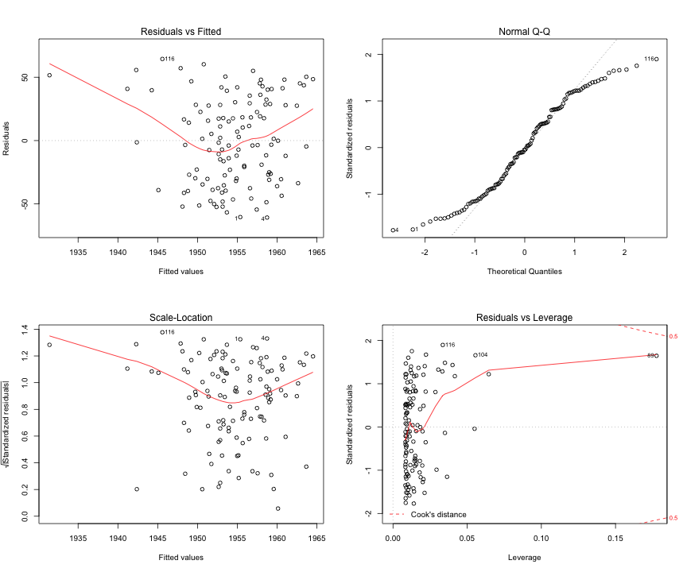

<!-- Center image on slide -->
<script src="http://ajax.aspnetcdn.com/ajax/jQuery/jquery-1.7.min.js"></script>
<script type='text/javascript'>
$(function() {
    $("p:has(img)").addClass('centered');
});
</script>


<style>
em {
  font-style: italic
}
strong {
  font-weight: bold;
}
</style>

<!-- Limit image width and height -->
<style type='text/css'>
img {
    max-height: 560px;
    max-width: 964px;
}
</style>

--- .quote
<br>
<br>
<br>
<q align=right>¿Qué es una <br>__Serie Temporal__? </q>

--- 
* Conjunto de observaciones registradas a intervalos regulares de tiempo. 
* En cada instante $\t_{i}$ la observación proviene de una variable que puede tener igual o diferente distribución
* El orden de llegada de los datos es importante

* Ejemplos: temperaturas, productividad del bosque a lo largo del año, cantidad de agua que lleva un río cada día, etc.  

* 

--- .quote
<br>
<br>
<br>
<q align=right>¿Por qué nos interesa analizar una <br>__Serie Temporal__? </q>

--- 
 * Para comprobar la ciclidad de un fenómeno
 * Analizar si los datos se ajustan bien a un modelo teórico
 * Analizar fenómenos espacio-temporales (avanzado)

<iframe width="250" height="150" frameborder="0"
  src="http://player.vimeo.com/video/104330415?title=0&amp;byline=0&amp;portrait=0" >
</iframe>

--- 
## Evolución de un proceso ecológico en diferentes ecosistemas

<iframe width="250" height="150" frameborder="0"
  src="http://player.vimeo.com/video/22945147?title=0&amp;byline=0&amp;portrait=0" >
</iframe>

--- .quote
## Objetivos:
__Explicar la evolución de un fenómeno a lo largo del tiempo__ 

 

--- .quote
## Objetivos
__Predecir su valores en el futuro__

 


--- .quote
<br>
<br>
<br>
<q align=right>__Tipos__ de Series Temporales? </q>


--- .quote
## Estacionarias 
 


> * Los datos varían todo el tiempo alrededor del mismo __valor medio__ y con la __misma variabilidad__. 
* La relación entre las observaciones en dos momentos del tiempo diferentes
sólo depende del número de observaciones que distan entre ambas

[Observatorio de Cambio Global de Sierra Nevada](https://obsnev.es/linaria)

--- .quote
## No Estacionarias 
 


> * La media, la varianza y/o la relación entre distantes equiespaciados __cambian__ a lo largo del tiempo. 
* Algunas oscilan con periodicidad regular (estacional)


--- .quote
## No Estacionarias 
 

> * Tendencia (serie no estacionaria estacional con tendencia)

--- 
## No Estacionarias  
 

> * Aumenta la variabilidad con el tiempo (serie no estacionaria con aumento de variabilidad)

---
## Tutoriales y Recursos:

[CRAN Task View: Time Series Analysis](http://cran.r-project.org/web/views/TimeSeries.html)

Falk M (2012). A First Course on Time Series Analysis - Examples with SAS. Chair of Statistics, University of Wurzburg. [link](http://www.statistik-mathematik.uni-wuerzburg.de/wissenschaftforschung/time_series/the_book/) 

<p align="center"></p>


--- &twocol
## Análisis de la tendencia 

*** =left
* ¿Incrementan o disminuyen los valores con el tiempo?
* En terminos estadísticos, determinar si la distribución de probabilidad de los datos cambian con el tiempo.
* Interés en determinar la cantidad o tasa de cambio 

# Hipótesis
* $H_0$: Los datos son independientes y aleatoriamente ordenados (No existe tendencia)
* $H_1$: Existe una tendencia

*** =right
<p align="center"></p>


--- .quote
<br>
<br>
<br>
<q align=right>Un pequeño __reto__</q>

--- .minicodefont

```r
m <- lm(p$prec~p$year)
msum <- summary(m)
msum$coefficients
```

```
##             Estimate Std. Error t value Pr(>|t|)
## (Intercept)  953.265   447.6411   2.130  0.03826
## p$year        -0.446     0.2255  -1.978  0.05357
```


 

--- .quote
## Test de Mann-Kendall
* Es un caso especial del test de correlación de Kendall ($\tau$)
* Comprobar si los valores de la variable ___Y___  tienden a aumentar o a disminuir con el tiempo
* Basado en el ranking relativo de los datos (no sobre los datos en sí)
* Test no paramétrico (no asumimos distribuciones de los datos)

(Mann, 1945; Kendall, 1975)

* Se calcula un valor de un __estadístico ($\tau$)__:
 * $\tau =$ -1; tendencia decreciente
 * $\tau =$ 0; no tendencia
 * $\tau =$ 1; tendencia ascendente

--- .quote
* Muy utilizado para el análisis de tendencias en series temporales en climatología, hidrología, etc. 

* __ventajas__: 
 * Es un test no paramétrico (no requiere que asumamos distribuciones en los datos)
 * Tiene una baja sensibilidad para cambios abruptos (datos faltantes) 

* __inconvenientes__:
 * no predicción
 * no informa sobre la tasa de cambio (pendiente)

* [Aplicaciones](http://obsnev.es/ontologia) 
<p align="center"></p>


---
<p align="center"></p>


--- .quote
<br>
<br>
<br>
<q align=right>Caso de __estudio__</q>

--- &twocol
# Evolución de la sequía en el estado de California durante los últimos 120 años 

*** =left
* La sequía es una preocupación global (cambio climático + aumento demanda)
* Los modelos indican que las regiones secas del mundo serán mas secas en el futuro
* En US, provoca daños anuales de entre $6-8 mill.
* California es una de las regiones mas afectadas por la sequía
* Pérdidas de -1.5 cm/año en las reservas de agua entre 2003 y 2012 
* Aumento severidad en los últimos años, especialmente el año 2014 en California

*** =right
<p align="center"></p>

---


Satellite image from NASA's Gravity Recovery and Climate Experiment (GRACE) mission showing California's devastating loss of fresh water (in red) since 2002. [NASA/JPL-Caltech/UCA](http://photojournal.jpl.nasa.gov/catalog/pia18816)

---
# ¿Qué vamos a hacer? 
Analizar la tendencia temporal del índice de sequía anual scPDSI (self-calibrate Palmer Drought Severity Index) durante los últimos 120 años (datos del [WestWideDroughtTracker](http://www.wrcc.dri.edu/wwdt/time/))
<br>
<br>
<p align="center"></p>


--- .minicodefont 

```r
anual <- read.table('http://www.iecolab.es/ecoinfo/scpdsi_annual.csv', header = TRUE, sep=',')
str(anual)
```

```
## 'data.frame':	120 obs. of  2 variables:
##  $ year  : int  1895 1896 1897 1898 1899 1900 1901 1902 1903 1904 ...
##  $ scpdsi: num  -0.85 1.05 -0.41 -1.73 0.5 -0.07 -0.27 0.01 -1.39 0.13 ...
```

```r
head(anual)
```

```
##   year scpdsi
## 1 1895  -0.85
## 2 1896   1.05
## 3 1897  -0.41
## 4 1898  -1.73
## 5 1899   0.50
## 6 1900  -0.07
```

--- .minicodefont  

```r
plot(anual$year, anual$scpdsi, type='o', 
     xlab='year', pch=19, col='#325B84',
     ylab='scpdsi', ylim=c(-6,6))
abline(h=0)
abline(h=-2, lty=2, col='red')
```

 

--- .minicodefont 
# Analizar la tendencia 

```r
library('Kendall')
# Aplicar la función MannKendall (consultar ayuda)
m <- MannKendall(anual$scpdsi)
m
```

```
## tau = -0.152, 2-sided pvalue =0.014
```

<br>
<br>
# ¿Se podría estimar la tendencia mediante un modelo lineal?


```r
ml <- lm(anual$year~anual$scpdsi)
summary(ml)
```

--- .minicodefont 
 

---  .minicodefont 

```r
summary(ml)
```

```
## 
## Call:
## lm(formula = anual$year ~ anual$scpdsi)
## 
## Residuals:
##    Min     1Q Median     3Q    Max 
## -60.74 -30.31  -1.52  28.56  64.41 
## 
## Coefficients:
##              Estimate Std. Error t value Pr(>|t|)    
## (Intercept)   1952.12       3.48  561.56   <2e-16 ***
## anual$scpdsi    -3.82       2.35   -1.62     0.11    
## ---
## Signif. codes:  0 '***' 0.001 '**' 0.01 '*' 0.05 '.' 0.1 ' ' 1
## 
## Residual standard error: 34.5 on 118 degrees of freedom
## Multiple R-squared:  0.0219,	Adjusted R-squared:  0.0136 
## F-statistic: 2.64 on 1 and 118 DF,  p-value: 0.107
```

--- .quote
<br>
<br>
<br>
<q align=right>¿En que meses es __mayor__ la tendencia</q>

--- .minicodefont 

 

--- .quote
## Estimación de la magnitud de la tendencia
* ___estimador Theil-Sen___ o ___estimador de la pendiende de Sen___ 
* Se trata de un estimador robusto de una tendencia (no es un test)
* Se calcula la mediana de las pendientes entre todos los pares de puntos 
* Permite comparar la tasa de cambio de las tendencias entre series temporales 

<p align="center"></p>

--- .minicodefont 
# Cargar Datos

```r
mensual <- read.table('http://www.iecolab.es/ecoinfo/scpdsi_monthly.csv', header = TRUE, sep=',')
library('reshape2') # Para manipular datos
library('zoo') # Para series temporales
str(mensual)
```

```
## 'data.frame':	480 obs. of  3 variables:
##  $ year : int  1895 1896 1897 1898 1899 1900 1901 1902 1903 1904 ...
##  $ value: num  -0.14 0.49 0.61 -1.64 -1.15 -0.68 0.47 -0.24 -0.36 -0.66 ...
##  $ month: int  6 6 6 6 6 6 6 6 6 6 ...
```

```r
head(mensual)
```

```
##   year value month
## 1 1895 -0.14     6
## 2 1896  0.49     6
## 3 1897  0.61     6
## 4 1898 -1.64     6
## 5 1899 -1.15     6
## 6 1900 -0.68     6
```

--- .minicodefont 
# Preparar Datos

```r
mensuales <- dcast(mensual, year ~ month, value.var = 'value')   
names(mensuales) <- c('year','jun','jul','aug','sep')
head(mensuales)
```

```
##   year   jun   jul   aug   sep
## 1 1895 -0.14 -0.17 -0.30  0.25
## 2 1896  0.49  0.67  0.87  0.86
## 3 1897  0.61  0.35  0.17  0.06
## 4 1898 -1.64 -1.64 -1.52 -1.35
## 5 1899 -1.15 -1.15 -0.90 -1.12
## 6 1900 -0.68 -0.73 -0.82 -0.78
```


--- .minicodefont 
# Convertir datos

```r
mizoo <- zoo(mensuales[-1], mensuales[,1])
str(mizoo)
```

```
## 'zoo' series from 1895 to 2014
##   Data: num [1:120, 1:4] -0.14 0.49 0.61 -1.64 -1.15 -0.68 0.47 -0.24 -0.36 -0.66 ...
##  - attr(*, "dimnames")=List of 2
##   ..$ : NULL
##   ..$ : chr [1:4] "jun" "jul" "aug" "sep"
##   Index:  int [1:120] 1895 1896 1897 1898 1899 1900 1901 1902 1903 1904 ...
```

--- .minicodefont
# Calcular la tendencia y estimar la pendiente 

```r
library('wq')
theil <- mannKen(as.ts(mizoo))
```

```
## Loading required package: ggplot2
```

```r
theil
```

```
##     sen.slope sen.slope.pct  p.value     S   varS miss     tau
## jun  -0.01268        -1.961 0.008621 -1159 194349    0 -0.1623
## jul  -0.01204        -1.965 0.010439 -1130 194351    0 -0.1583
## aug  -0.01082        -1.862 0.014204 -1082 194352    0 -0.1515
## sep  -0.01164        -2.035 0.002963 -1311 194345    0 -0.1836
```


--- .quote
<br>
<br>
<br>
<q align=right>__Reto extra__: <br>¿Cómo ha evolucionado la sequía anual en los últimos 15 años? <br>¿Qué meses han mostrado una mayor tasa de cambio? </q>

--- 


